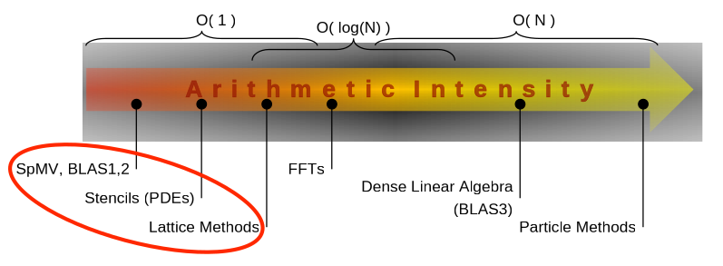
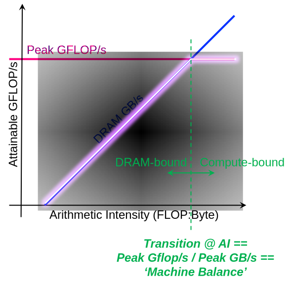
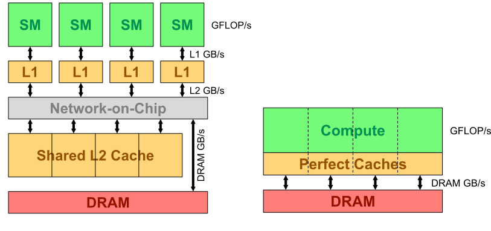

# roofline 性能模型

## 计算密度的概念
对于冯诺依曼结构的计算机，其在计算过程中，往往需要将数据从内存中加载到计算单元中，进行计算后，将结果写回内存。
由于，现代计算硬件的计算速度和访存速度存在跨越数个数量级的差异（如现代GPU 双精度浮点计算速度往往都是几十 TFLOPS，而访存也才几百 GB/s或者才刚过 TB/s）。
例如，英伟达在 2022年 GTC上发布最新一代 H100 GPU，其相关性能参数如下：
|参数 | 值 |
| -- | -- |
| FP64 | 30 TFLOPS  |
|GPU memory  | 80GB |
| GPU memory bandwidth | 3TB/s |

参数链接：https://resources.nvidia.com/en-us-tensor-core/nvidia-h100-datasheet 。
由于访存速度和计算速度的差异，我们往往需要从访存和计算两个层面开对算法进行性能分析。

我们在考虑 GPU/DCU 上设计的算法的性能时，我们往往有一系列评价指标，例如：
**计算量**：指在给定算例下，整个算法的浮点计算次数。一般我们用 **FLOPs** 了表示（其中，s小些，表示复数）。例如 GEMM，对于两个都是 N\*N 的矩阵而言，其计算量为 $2N^3$（这里加法和乘法算作两次浮点计算次数；注：不过也有时候，将乘法和加法算作一次，因为硬件可以用一条 FMA 指令来完成乘加操作）。
**访存量**：访存量一般指算法计算时所需访问存储单元的字节大小，一般用 **Bytes** 表示。包括 load 的数据量和 store 的数据量。例如，GEMM，对于两个都是 N\*N 的矩阵，其访存量是 $3N \times N$。
**时间复杂度、空间复杂度**：这个就是我们学习传统算法提到的时间复杂度、空间复杂度，这里不做赘述。

对于给定的算法，我们可以用其计算量除以访存量，得到算法在单位访存量下所需的计算量。我们称之为该算法的计算密度（Arithmetic Intensity），也有人叫它计算访存比。

计算密度 I = FLOPs/Bytes= 计算量/访存量。

算法的计算密度，可以反映该算法是计算密集型的还是访存密集型的。计算密度是算法的固有属性，不随硬件环境、编译器环境等改变而改变（但可能随算法中的某些参数改变而改变）。

对于计算密度较低的算法，其表明该算法访存量很大，而计算量相对较小。这时，算法的执行时间往往受限于硬件的访存带宽。我一般们称该情况下的算法为访存密集型算法。典型的如 CSR 格式的稀疏矩阵向量乘法（CsrMV）。
相反地，如果计算密度较高，其表明该算法计算量很大，而访存量相对较小。这时算法的执行时间往往受限于硬件的理论计算能力。我们一般称该情况下的算法为计算密集型的算法。典型的如稠密计算乘法 GEMM。

在 HPC 中，一些典型算法的计算密度分布如下图：

<small>*图片来源: roofline 报告[^roofline_report] </small>

## roofline 性能模型
对于给定的硬件，我们将计算密度作为横坐标，理论上算法可以达到的计算速度（FLOPs/s）为纵坐标，画一个图，可以得到 roofline 性能模型。该模型是用于评估程序或算法在硬件上能达到的性能上界的模型。
考虑到理论访存带宽和理论峰值计算能力的限制，可有：

计算速度(FLOPs/s) = min(理论峰值性能, 理论访存带宽*计算密度)

以 NV H100 为例，其 roofline 性能模型如下：

考虑到我们实际的应用，其要么会落在黄色区域，要么落在绿色区域，且不回超过理论值。
另外，还有一点需要特别说明的是，roofline 画图时往往会将横坐标与纵坐标都取上以 2 为底的对数。这主要是为了方便表示和进行性能推断（如考虑摩尔定律的存在，隔代的硬件性能会翻倍，用 log 会方便将两代硬件放在一起比较）。
最终，取 log 后，大概是形如下图的形式：

总结来说，roofline 模型描述是，在计算机访存带宽和计算性能双重受限的条件下，
应用/算法可以达到的理论的计算性能。由于对应的曲线很像屋顶，故此称为 roofline 模型。
以上是 roofline 的一个定性的概念，本小节后续都会围绕这个概念展开，深入讨论 roofline。

## DRMA 受限的 roofline
在这部分之前，我们先考虑稀疏矩阵向量乘（SpMV）的问题，讨论计算密度的计算。
$y= A x + y$（这是一种简化的形式，也有相关资料将其表述为更一般的形式 $y= \alpha A x + \beta y$ ），其中，A 是稀疏矩阵（$m$ 行， $n$ 列，其中非零元素数为 NNZ），$x$、$y$ 均为稠密的向量（长度都为 $n$），$\alpha$ 和 $\beta$ 均为标量。
为了计算 SpMV 的计算密度，显然其浮点运算次数为：$FLOPs = 2 NNZ$。
当其访存量 Bytes 时，其中矩阵 A 因为只用被 load 一次，其访存量是固定的（如果 A 矩阵采用 CSR 格式，其访存量为 $b_i*NNZ+b_v*NNZ+b_i*(m+1)$，其中 $b_i=sizeof(int), b_v=sizeof(double)$，这里我们约定索引用 int 存储，非零用 double 存储）。另外，$y$ 向量会被 load一次和 store 一次，访存量也是很容易得出的。
但$x$ 向量由于会被多次访问，且可能会被 L1/L2/L3 cache 缓存上，因此难以确定 $x$ 向量实际访存量。

为此，我们需要一些假设，即完美 cache 的假设（perfect cache）：
1. Peak GFLOP/s on data in L1. 即: 假设数据从 cache 里面参与计算的速度，与寄存器文件一样快。
2. Load-balanced SPMD (single program multiple data) code. 完美的负载均衡假设，不会因为某个任务（如CUDA某个 block上的任务）负载多而拖慢整体速度。
3. Sufficient cache bandwidth/capacity. cache 具有充足的容量和访问带宽。

以 NVIDIA GPU 为例，下图描述了该假设前后的计算架构变化的情况：

在上述 SpMV 例子中，以上假设能保证所有需要的数据只用从 DRMA 中 load 或 store 一次（因为perfect cache 作用）。这种假设下，$x$ 向量可以被 cache 完全缓存，而不用考虑cache 缺失时要从 DRMA 中load 的开销。这时候，计算访存量的模型中，只要考虑该算法的输入和输出数据的量就行了（如SpMV 中，输入数据是 A 矩阵、$x$ 向量及 $y$向量，输出是 $y$向量）。因此，该条件下，我们可以得到 CSR 存储格式下的 SpMV 访存量 $Bytes = b_i*NNZ+b_v*NNZ+b_i*(m+1) + 2{b_v}m+{b_v}n$，然后计算密度为 $I=\frac{2NNZ}{b_v(NNZ+2m+n)+b_i(NNZ+m+1)}$。一般地，如果矩阵不是特别稀疏（例如每一行都有几个或者几十个非零元素，即 NNZ 远大于 $m$和$n$），那么我们可以近似地说 $I=\frac{2}{b_v+b_i}=1/6$（如果硬件提供了 FMA 指令，那么浮点运算次数应该为 NNZ，而不是 2NNZ，此时 $I = 1/12$）。

基于完美 cache 假设，我们可以较为容易计算模型/算法的计算密度。如果算法中没有数据重用的话（或几乎没有数据重用），实际的访存量应该和该假设下计算的访存量差不多。如果算法中有一定量或者很多数据重用，那么实际的访存量和完美cache假设下访存量会有很大偏差，这个时候就需要把 cache 因素考虑进去了。

## Cache 下的 roofline 性能模型
todo：

## 参考资料
主要参考文献 [^1]
主要参考文献2 [^2]

### roofline 的原始论文及相关报告
- roofline 的原始论文[^roofline_paper]
- 另一篇roofline 的原始论文[^roofline_paper2]
- roofline 论文作者的报告[^roofline_report]
- roofline 论文作者的另一个报告[^roofline_report2]

[^1]: - Charlene Yang, Lawrence Berkeley National Laboratory, Jun 16 2019 Frankfurt, [Introduction to the Roofline Model](https://www.nersc.gov/assets/Uploads/Tutorial-ISC2019-Intro-v2.pdf). 
[^2]: - NVIDIA [performance-analysis-of-gpu-accelerated-applications-using-the-roofline-model](https://developer.download.nvidia.cn/video/gputechconf/gtc/2019/presentation/s9624-performance-analysis-of-gpu-accelerated-applications-using-the-roofline-model.pdf)
[^roofline_paper]: - WILLIAMS S, WATERMAN A, PATTERSON D. Roofline: An Insightful Visual Performance Model for Multicore Architectures[J/OL]. Commun. ACM, 2009, 52(4): 65-76. DOI: https://doi.org/10.1145/1498765.1498785.
[^roofline_paper2]: - WILLIAMS S, PATTERSON D, OLIKER L, et.al. The roofline model: A pedagogical tool for program analysis and optimization[C/OL]//2008 IEEE Hot Chips 20 Symposium (HCS). 2008: 1-71. DOI: https://doi.org/10.1109/HOTCHIPS.2008.7476531.
[^roofline_report]: - Samuel Williams, A Vision for Integrating Performance Counters into the Roofline model, https://crd.lbl.gov/assets/pubs_presos/pmu08-roofline-talk.pdf
[^roofline_report2]: - Samuel Williams, Roofline Performance Modeling for HPC and Deep Learning Applications, https://crd.lbl.gov/assets/Uploads/S21565-Roofline-1-Intro.pdf
